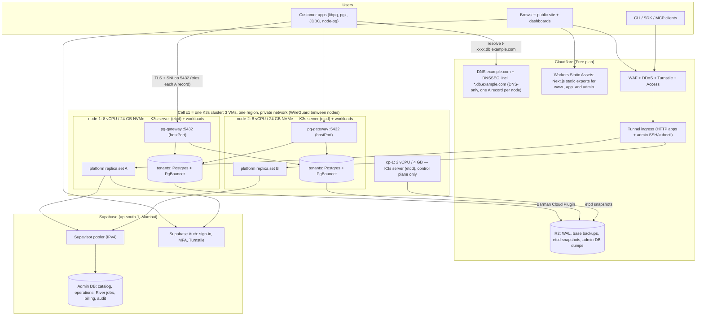
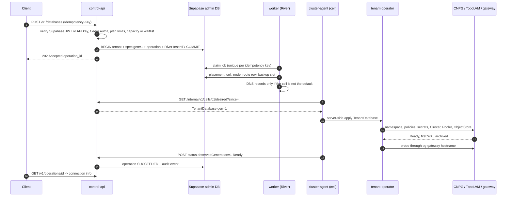
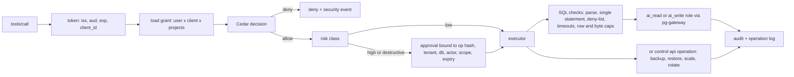

# 01 — Architecture (Blueprint 4.0)

Status: implementation-ready reference architecture, revised 2026-09-29.
Blueprint 4.0 returns to **K3s**, the Kubernetes distribution of the original PDF, and makes the design **provider-neutral**: cells run on plain Linux VMs from any provider that passes the checklist in `03-cost-model.md` §2. No provider is chosen yet. The PDF's product rules (tenant model, invariants, MCP permission model, acceptance gates) still apply. Costs and capacity numbers live in `03-cost-model.md`.

---

## 0. One-paragraph summary

Customer PostgreSQL databases run on **our own machines**: a **cell** of three Linux VMs in one region, running **K3s** with a three-member embedded etcd. One small VM (2 vCPU / 4 GB) runs only the Kubernetes control plane; two larger VMs (8 vCPU / 24 GB, local NVMe) run the control plane too, plus the platform and the tenants. Each cell has its own Rust **pg-gateway**, Cloudflare Tunnel and R2 backup bucket. One **control plane** written in Go decides what should exist; it keeps **only its own admin/management data** in **Supabase** (Free, then Pro) and signs users in with **Supabase Auth**. It never stores or proxies customer rows. Cloudflare's free plan fronts all HTTP traffic (Tunnel, WAF, Access, Turnstile, the Next.js static site and dashboards), serves DNS and stores backups in **R2**. Customer Postgres traffic never passes through Cloudflare's proxy; clients connect straight to the gateway on the nodes' public IPs. The platform costs ≤ ₹9,000/month. Growth adds nodes, then cells (on the same or another provider, including AWS or GCP later) with the same code; each paid step is taken only when revenue already covers it.

---

## 1. Invariants and reliability targets

1. One CloudNativePG `Cluster` + one customer database per tenant. The Pod is the compute boundary; the database is the data boundary.
2. Writes for one database are never spread across clusters or providers. Horizontal scale = more nodes, more cells, tenant migration.
3. The control plane never stores or proxies customer data. Supabase holds only our management metadata.
4. **Static stability:** if the control plane, Supabase or Cloudflare's proxy, Tunnel or API is down, running customer databases keep serving traffic. Only changes (create/scale/restore) wait. Database hostnames are DNS-only records in Cloudflare DNS; during an authoritative-DNS outage, clients keep working from cached answers for the record TTL.
5. All changes are asynchronous, idempotent, retry-safe and audited.
6. Customers and AI agents never receive Kubernetes, VM, R2 or Supabase credentials.
7. No availability promise for a tier until its acceptance gate passes on the real deployment.
8. **Spend is capped** at ₹9,000/month (`03-…` §1). Nothing billable is created unless the build-plan step and the cost model say so.
9. **Provider-neutral:** nothing in code or manifests depends on one VM provider. Provider-specific pieces live only in `deploy/terraform/modules/vm-<provider>` and the provider adapter.

**About "100 % reliability":** no system achieves it, and promising it would be false. The design removes single points of failure step by step and publishes measured targets:

| Tier | Target availability (after gates pass) | RPO | RTO |
|---|---|---|---|
| `base` (single instance, local NVMe) | best effort, 99.5 % goal | ≤ 5 min | ≤ 1 h (restore onto a replacement node) |
| `plus`, `premium` (single instance, local NVMe) | best effort, 99.5 % goal | ≤ 1 min | ≤ 1 h |
| HA (Phase 3: primary + replica on different nodes) | 99.9 % | 0 (sync option) – ≤ 1 min | ≤ 1 min (failover) |
| HA + DR (Phase 4: replica cell in another region) | 99.9 % + region survival | ≤ 1 min cross-region | ≤ 30 min region failover |

What survives what, from launch:
- **Any one VM lost:** the Kubernetes control plane keeps quorum (2 of 3 etcd members) and the platform keeps running (every stateless service has 2 replicas, one per node). Tenants on the lost node restore from R2 onto its replacement.
- **Both large nodes lost, or the whole provider region:** tenants restore from R2 into a rebuilt or new cell (runbook `RebuildCell`); nothing is lost beyond each plan's RPO.

---

## 2. Topology



"Platform replica set" = control-api, worker, mcp-server, mcp-auth, tenant-operator, cloudflared, observability and cell add-ons, spread across both nodes (§5.2).

The control plane is stateless (its state is in Supabase), so it runs inside the cell. From Phase 4 it runs **active-active in two cells**: each cell has its own tunnel, and Cloudflare Load Balancing (paid add-on, bought when Phase 4 is funded) spreads `api.`/`mcp.`/`oauth.` across both.

### 2.1 Layers and boundaries

| Layer | Runs on | Responsibility | Hard boundary |
|---|---|---|---|
| Edge | Cloudflare Free | DNS, WAF, DDoS, bot checks, Access for staff, static web apps, HTTP and admin tunnel | No public HTTP or SSH on the VMs; Postgres never proxied |
| Control plane | Go services in the cell | AuthN/Z, catalog, placement, capacity, operations, billing, MCP | Admin metadata only |
| Admin DB | Supabase (Free → Pro) | Durable state of the control plane + job queue | Reached only from the cell's node IPs, through the pooler |
| Cell data plane | K3s cluster | Tenants' PostgreSQL, poolers, gateway, local ops | Default-deny network, restricted Pod Security, encrypted node-to-node traffic |
| Recovery plane | R2 (+ a second cell in Phase 4) | WAL archive, base backups, etcd snapshots, admin-DB dumps | Restore-tested before RPO/RTO is published |

---

## 3. Language split

| Component | Language | Why |
|---|---|---|
| `pg-gateway` (Postgres TLS/SNI router on the data path) | **Rust** (tokio, rustls, kube-rs) | Every customer connection passes through it. No GC pauses, low memory per connection, memory safety for an internet-facing TLS terminator, precise control of the Postgres handshake. Same choice as Neon's proxy. |
| control-api, worker, cluster-agent, provider adapters | **Go** | Kubernetes SDKs are Go-native; River is Go; one toolchain |
| tenant-operator | **Go** (controller-runtime) | CloudNativePG and the operator ecosystem are Go |
| mcp-server | **Go** (official MCP Go SDK) | Supports MCP spec 2026-07-28 |
| mcp-auth | **Go** (zitadel/oidc, OpenID-certified library) | Standards-heavy, security-sensitive; use a certified protocol library |
| CLI `dbcloud` | **Go** (cobra) | Single static binary for every OS |
| Web apps: public site, customer dashboard, admin dashboard | **TypeScript** (Next.js 16 App Router, **static export**) | Built to static files and served free from Cloudflare Workers Static Assets; no server code, so none of Next.js's server-side vulnerabilities apply |

Rule: Rust only where the process sits on the per-connection data path. Everything else on the backend is Go. Every backend component ships as a multi-arch (`linux/amd64` + `linux/arm64`) container image built with Docker Buildx and stored in ghcr.io; K3s runs the images with containerd. The web apps ship as static files.

---

## 4. Provider, region and network

### 4.1 Provider (not chosen yet)

- Any provider that passes the VM checklist (`03-…` §2.1): India region or ≤ 70 ms from Indian users, KVM, local NVMe with room for LVM, **free private network**, a public IPv4 per VM, ≥ 3 TB/month included transfer, flat monthly price, and good fio/fsync and CPU-steal numbers in spike S2.
- Only the value-VPS class fits the ₹9,000 cap with a useful cell (`03-…` §2.2). Providers are shortlisted in build-plan Step 0.0, chosen in Step 1.1 after spike S2, and recorded in ADR-024.
- A cell never spans providers or regions: K3s supports embedded etcd only with all servers on one private network in one location, and cross-provider traffic is slow, fragile and billed (`03-…` §2.3). AWS, GCP or another region become **separate cells** later.

### 4.2 Network per cell

| Network | Addresses | Contents |
|---|---|---|
| Provider private network | for example 10.20.0.0/24 | node private IPs; K3s API, etcd, kubelet and WireGuard traffic |
| Pod network (flannel) | 10.42.0.0/16 (K3s default) | pod IPs, /24 per node |
| Service network | 10.43.0.0/16 (K3s default) | ClusterIPs |
| Public IPv4 per VM | provider-assigned | `node-1`, `node-2`: TCP 5432 only; `cp-1`: nothing inbound |

- **flannel `wireguard-native`** over the private network: pod-to-pod traffic between nodes (gateway → tenant Postgres, replication, backups) is encrypted even if the provider's private network isn't.
- **Firewall** (provider firewall where available, plus nftables on every VM, both from code): inbound from the internet only TCP 5432 on `node-1`/`node-2`. Between nodes, only the private network, and only the K3s ports (6443, 2379–2380, 10250, WireGuard 51820–51821, Spegel 5001). **No public SSH and no public K3s API**: admins reach both through Cloudflare Tunnel + Access (§11). The provider's web console is the break-glass path.
- **Egress:** each VM egresses from its own public IPv4. Those IPs are the only addresses on Supabase's network allowlist.
- **Cloud metadata endpoints** (169.254.169.254 on many providers) are blocked for pods by NetworkPolicy (`ipBlock` `0.0.0.0/0` with `except` for private, link-local and metadata ranges) in every namespace; no workload uses instance credentials.
- **IPv6:** K3s fixes the IP families at cluster creation, and private networks are often IPv4-only. The cell is created **IPv4-only**; a later cell can be dual-stack if its provider supports it end to end.

---

## 5. Cells (K3s clusters)

### 5.1 Cluster settings

- **K3s v1.36** (stable channel, pinned to an exact release such as `v1.36.4+k3s1`), tracking Kubernetes 1.36, which CloudNativePG 1.30 supports. K3s is a CNCF-certified Kubernetes distribution; CNPG officially targets vanilla Kubernetes, so spike S1 runs the Kubernetes conformance suite and the CNPG e2e smoke tests on the pinned K3s.
- OS: Ubuntu 24.04 LTS on every VM, unattended security updates (reboots scheduled, §12.3), sysctls from the K3s CIS hardening guide.
- **Datastore: embedded etcd, three servers** (`cp-1`, `node-1`, `node-2`) on the private network. etcd snapshots every 6 h, 28 kept, compressed, copied to R2 (`--etcd-s3-*`, region `auto`). The K3s server token is stored in the password manager, because restoring a snapshot needs it.
- **Bundled components:** Traefik, ServiceLB and local-path-provisioner are disabled (`--disable=traefik,servicelb,local-storage`); CoreDNS (2 replicas) and metrics-server are kept.
- **Networking:** flannel `wireguard-native` (§4.2); **K3s's embedded network-policy controller (kube-router)** enforces Kubernetes NetworkPolicy, so no separate CNI or policy engine is installed. Spike S1 verifies the policies we rely on (default deny, namespace selectors, `ipBlock` with `except`, egress).
- **Registry:** images come from ghcr.io (private) with a read-only token in `/etc/rancher/k3s/registries.yaml`; K3s's embedded registry mirror (**Spegel**, `--embedded-registry`) lets nodes pull images from each other, so a ghcr.io outage doesn't block restarts of images already in the cell. Images are referenced by digest.
- **Hardening** (K3s CIS guide for benchmark v1.12): `secrets-encryption: true`, `protect-kernel-defaults: true`, Pod Security Admission config (restricted by default, exemptions listed in §6.3), API audit log with rotation, NodeRestriction and EventRateLimit admission plugins, TLS cert file permissions, separate agent token, token rotation runbook.
- **Kubelet:** `max-pods=110`, `kube-reserved=cpu=500m,memory=2Gi` (the K3s server process), `system-reserved=cpu=200m,memory=512Mi`, eviction threshold 100 Mi (`03-…` §6).

### 5.2 Nodes

| Node | Shape (reference) | Role | Taint/labels |
|---|---|---|---|
| `cp-1` | 2 vCPU / 4 GB, ≥ 40 GB SSD | K3s server (etcd member), control plane only | `CriticalAddonsOnly=true:NoExecute` |
| `node-1`, `node-2` | 8 vCPU / 24 GB (32 GB if the ceiling allows), ≥ 200 GB NVMe | K3s servers (etcd members) + platform + tenants | `dbcloud.io/pool=tenant`, `topology.kubernetes.io/zone` = provider zone or node name |
| `node-3…` (growth) | same shape | K3s **agents** (no etcd) + tenants | `dbcloud.io/pool=tenant` |

- Every platform Deployment has 2 replicas with a `topologySpreadConstraints` rule across `node-1`/`node-2`; singletons (cluster-agent, River UI) are stateless and reschedule within seconds.
- Disk layout on `node-*`: root filesystem (OS, containerd, K3s, etcd) ≈ 50 GB; the rest of the NVMe is an LVM physical volume in volume group **`tenantvg`**, created by the node bootstrap. K3s recommends a separate disk for etcd; with one disk per node, spike S2 measures etcd fsync p99 under full tenant load, and alerts fire at 10 ms.
- Nodes are created by `deploy/terraform/modules/vm-<provider>` when the provider has a Terraform provider, otherwise by hand from the same cloud-init file; either way the node bootstrap (`deploy/node-bootstrap/`) is identical and idempotent.

### 5.3 Cell capacity targets

| Limit | Value | Source of the number |
|---|---|---|
| Servers per cell | 3 (embedded etcd); growth nodes join as agents | K3s HA docs |
| **Planned max nodes per cell** | **50** | K3s: 2 vCPU / 4 GB servers handle up to 350 agents; we stay far below, and larger cells go to new cells |
| **Planned max tenants per cell** | **1,500** | Neon reported Kubernetes degradation past ~10,000 databases per cluster; we stay far below |
| Kubernetes objects per tenant | ~20 | §6.1 |
| pg-gateway | one per tenant node (DaemonSet) | §8.2 |

When a cell reaches 70 % of any planned limit, the next cell is provisioned; placement stops using a cell at 100 %. The limits are planning targets until the Phase 2 scale gate measures them.

### 5.4 What a managed Kubernetes would give, and what we run instead

| Feature | Our substitute on K3s |
|---|---|
| Managed control plane and upgrades | Three K3s servers with embedded etcd; **system-upgrade-controller** Plans (servers first, one at a time, then agents), following a pinned version, never skipping a minor |
| Managed load balancer | pg-gateway on `hostPort` 5432 on every tenant node + one DNS A record per node (§8.2) |
| Managed block storage | TopoLVM on local NVMe; R2 for backups; `ReplicaCluster`/HA plans for redundancy |
| Cloud secret manager | Flux decrypts **SOPS**-encrypted secrets (age keys) from git; K3s encrypts Secrets at rest |
| Cloud IAM / workload identity | Not needed: no workload calls a provider API with instance credentials; each service has a scoped token for exactly one external API |
| Autoscaling | **Capacity controller** in the worker: computes demand, waitlists new databases at the owner-set `max_nodes`, and (once the chosen provider has an API) adds a node through the provider adapter |
| Managed audit and scanning | K3s API audit log shipped to VictoriaLogs; Trivy in CI and a weekly `trivy k8s` Job; cosign-signed images |
| Bastion | Cloudflare Tunnel + Access for SSH and `kubectl` (§11) |
| Financially backed SLA | Static stability + measured targets now; HA plans (Phase 3) and a second cell (Phase 4) later |

---

## 6. Tenant model

### 6.1 Objects per tenant (namespace `t-<ref>`)

```
Namespace t-<ref>               labels: dbcloud.io/tenant, plan, cell; PSA enforce=restricted
├── ResourceQuota, LimitRange
├── NetworkPolicy (default deny + explicit allows: gateway → pooler and pg :5432, pooler → pg,
│                  pg ↔ pg (HA replication), cnpg-operator → pg :8000, pg → DNS,
│                  pg → R2 (public IPs only: 0.0.0.0/0 except private, link-local and metadata ranges),
│                  vmagent → metrics ports)
├── Secrets (app, owner, ai_read, ai_write roles; R2 credentials)   generated by the operator
├── cnpg Cluster "pg"           instances 1 (base/plus/premium) or 2+ (HA, Phase 3)
├── PVC per instance            storageClass tenant-local (TopoLVM)
├── cnpg Database "app", DatabaseRole x N
├── cnpg Pooler "rw"            PgBouncer, transaction mode (pooled hostname)
├── barmancloud ObjectStore     R2 bucket of the cell, prefix t-<ref>/, sidecar resources, retention interval
└── cnpg ScheduledBackup        weekly base backup, slot staggered per tenant
```

All of it is rendered by the **tenant-operator** from one `TenantDatabase` custom resource. Routes for pg-gateway are read directly from `TenantDatabase` objects, so there is no second source of truth. vmagent discovers tenant pods by their CNPG labels.

### 6.2 `TenantDatabase` (sketch)

```yaml
apiVersion: dbaas.dbcloud.io/v1alpha1
kind: TenantDatabase
metadata:
  name: t-8f3k2m9q
spec:
  ref: t-8f3k2m9q                  # immutable
  desiredGeneration: 7             # from the admin DB; status.observedGeneration echoes it
  plan: base
  postgres: { major: 18, imageCatalog: pg18, parameters: { max_connections: "25", shared_buffers: "128MB" } }
  resources: { cpuRequest: "100m", cpuLimit: "500m", memory: "512Mi" }   # memory request = limit
  storage: { class: tenant-local, size: 5Gi }
  instances: 1
  pooler: { mode: transaction, defaultPoolSize: 10, maxClientConn: 100 }
  backup: { retentionDays: 7, baseSchedule: "0 40 20 * * 3", archiveTimeoutSeconds: 300 }   # weekly slot chosen by the worker from a hash of ref
  access:
    allowCIDRs: ["0.0.0.0/0"]
    maxDirectConnections: 10       # max_connections − pool size − 5 reserved
    state: active                  # active | suspended | maintenance | deletion_pending
status:
  observedGeneration: 7
  conditions: [ { type: Ready, status: "True", reason: ClusterHealthy } ]
  endpoints: { pooled: "t-8f3k2m9q.db.example.com", direct: "t-8f3k2m9q-direct.db.example.com" }
  firstRecoverabilityPoint: "2026-09-23T20:40:31Z"
```

### 6.3 Resource enforcement

| Policy | Enforced by |
|---|---|
| Plan entitlement and the waitlist | control-api, before anything reaches Kubernetes |
| CPU: request = the plan's guaranteed vCPU, limit = its burst (`03-…` §4); memory request = limit on every container | scheduler + cgroups |
| Namespace envelope | ResourceQuota + LimitRange |
| Pod hardening | Pod Security Admission `restricted` everywhere, except the namespaces listed next |
| PSA exemptions (documented, admission-guarded) | `kube-system` (K3s components), `topolvm-system` (node plugin), `dbcloud-edge` (pg-gateway's `hostPort` 5432), `observability` (node-exporter, Fluent Bit) |
| Guardrails against operator bugs | ValidatingAdmissionPolicy (CEL): no LoadBalancer/NodePort Services, no hostPath, hostPort or privileged pods in `t-*`; `hostPort` only for the pg-gateway DaemonSet |
| Network | K3s's network-policy controller (kube-router) enforcing NetworkPolicy |
| Connections | pg-gateway per-tenant caps (pooled and direct) + PgBouncer `max_client_conn` + Postgres `max_connections` |

Admission uses node **Allocatable**, not VM size: `available = allocatable − platform reserve − 15 % headroom`.

---

## 7. Storage

### 7.1 `tenant-local` — TopoLVM on local NVMe

- The node bootstrap creates `tenantvg` from the NVMe space left after the ≈ 50 GB root filesystem (custom partitioning at install, or a second local disk where the provider offers one).
- TopoLVM gives each tenant a **thick** logical volume (xfs, `WaitForFirstConsumer`, expandable, storage-capacity tracking). A full tenant can't fill the node, unlike local-path-provisioner, which ignores PVC sizes and isn't used.
- Data is node-bound: planned node changes use evacuation (§12.3); unplanned node loss restores from R2. RPO = `archive_timeout`: 300 s for `base`, 60 s for `plus` and `premium`.
- I/O is shared by every tenant on the node. Weekly base backups are staggered per tenant. Spike S2 measures fio + pgbench at planned density on the chosen provider; if it falls short, density is reduced before anything paid is added.

### 7.2 Network storage

None at launch. HA plans (Phase 3) get redundancy from Postgres replication across nodes (CNPG recommends shared-nothing local storage), not from network disks.

---

## 8. Endpoints, DNS and gateways

### 8.1 Hostnames

| Hostname | DNS | Path |
|---|---|---|
| `example.com`, `www.example.com` | Cloudflare, proxied | Workers Static Assets: public site (product, pricing, docs, and the About, Contact, Terms, Privacy, Refund/Cancellation and Shipping pages Razorpay requires) |
| `app.example.com`, `admin.example.com` | Cloudflare, proxied | Workers Static Assets (admin behind Cloudflare Access) |
| `api.example.com`, `mcp.example.com`, `oauth.example.com` | Cloudflare, proxied | Tunnel → cloudflared → Service |
| `jobs.example.com` (River UI), `grafana-<cell>.example.com` | Cloudflare, proxied | Tunnel + **Cloudflare Access** (staff only) |
| `ssh-<node>.admin.example.com`, `k8s-<cell>.admin.example.com` | Cloudflare, proxied | host-level admin tunnel + **Cloudflare Access** (staff only; §11) |
| `<ref>.db.example.com` (pooled), `<ref>-direct.db.example.com` (direct) | Cloudflare DNS, **DNS-only** (not proxied) | wildcard `*.db.example.com` with **one A record per tenant node** (public IPv4 of `node-1` and `node-2`), TTL 300 s |

- **Why several A records:** libpq tries every address a host name resolves to, in order, until one connects (and `load_balance_hosts=random` spreads clients); pgx v5 and Node.js do the same. If a node is down, clients reach the other node's gateway, which routes to any tenant in the cell. When a node is lost for good, the worker removes its record through the Cloudflare API (an optimization, not a dependency: clients already skip dead addresses).
- **Floating IP (optional):** if the chosen provider offers a movable IP cheaply, it can replace the multi-record scheme later; the gateway is unchanged.
- Cloudflare DNS is free and unmetered with DDoS protection, so a query flood can't create a bill. DNSSEC for `example.com` is managed by Cloudflare. The node IPs are also shown in the dashboard for emergencies.
- Tenants in a non-default cell (Phase 4) get explicit records (`<ref>.db` and `<ref>-direct.db` → that cell's node IPs), which override the wildcard. The Free zone allows 200 records; beyond that the zone goes to Cloudflare Pro, paid from revenue at that scale.
- Certificates: wildcard `*.db.example.com` from cert-manager + Let's Encrypt DNS-01 with the Cloudflare solver (token scoped to DNS edit on `example.com`), hot-reloaded by the gateway.

### 8.2 pg-gateway (Rust)

A **DaemonSet on every tenant node** in namespace `dbcloud-edge`, listening on `hostPort` 5432 (the CNI portmap plugin DNATs to the pod without masquerading, so client source IPs are preserved for allowlists). `updateStrategy: RollingUpdate` with `maxUnavailable: 1`, so one node always serves while the other rolls. Spike S3 confirms source-IP preservation and failover between the A records on the chosen provider.

| Function | Behaviour |
|---|---|
| Negotiation | `SSLRequest` (answers exactly one `S` byte, rejects extra buffered bytes) and PG17+ direct TLS (`sslnegotiation=direct`, ALPN `postgresql` required); `GSSENCRequest` refused; plaintext refused **except `CancelRequest`**, which libpq sends unencrypted |
| Tenant resolution | TLS SNI; fallback `options=endpoint%3D<ref>` for clients that don't send SNI |
| Routes | watches `TenantDatabase` objects in its own cell (kube-rs, RBAC `get/list/watch` on `tenantdatabases` and `endpointslices` only); in-memory map. **Readiness requires a complete initial list.** If the API server is unavailable at start-up, a new replica bootstraps from a ready peer's signed route snapshot (mTLS over the headless Service), so a restart during an API outage never answers `08004` to real tenants |
| Access control | per-tenant IP allowlist (client IPs preserved), per-tenant caps for pooled and direct connections, connection-rate limit, a global connection cap per node |
| Errors | proper Postgres `ErrorResponse`: `57P03` suspended/maintenance, `53300` too many connections, `28000` IP not allowed, `08004` unknown tenant, `57P01` on drain |
| Forwarding | pooled hostname → the tenant's PgBouncer pod (transaction mode); `-direct` hostname → the Postgres primary pod (session semantics: LISTEN/NOTIFY, temp tables, session settings, migrations). The gateway dials pod IPs from EndpointSlices, over the encrypted pod network when the tenant is on the other node. It relays SCRAM authentication and **always removes `SCRAM-SHA-256-PLUS`** from the server's mechanism list, because channel binding can't survive TLS termination at the gateway. Then bytes flow both ways (`copy_bidirectional`) |
| Cancel requests | the gateway replaces `BackendKeyData` with its own key, which encodes the issuing replica ID and an HMAC (in the process-ID field for protocol 3.0, in the longer key for 3.2). libpq sends a cancel to the address its session used, so it normally reaches the issuing replica; if not, the receiving replica verifies the HMAC and forwards it over internal mTLS to the owner |
| Keepalive and drain | TCP keepalive 60 s towards clients and backends. Shutdown: fail readiness → stop accepting → drain existing sessions up to 10 min → send `57P01` → exit |
| Operations | Prometheus metrics per tenant (capped series), structured tracing logs |

Known limit, documented for customers: `channel_binding=require` is not supported, because TLS ends at the gateway (the default `prefer` works on both hostnames).

### 8.3 HTTP ingress: Cloudflare Tunnel

- **One remotely managed tunnel per cell** for HTTP apps; `cloudflared` Deployment with 2 replicas, one per node; `/ready` probe.
- A second, **host-level admin tunnel**: `cloudflared` as a systemd service on each VM (not in Kubernetes, so it works when the cluster doesn't) exposing SSH and the K3s API behind Cloudflare Access (§11).
- Phase 4 active-active: `api.`, `mcp.` and `oauth.` sit behind **Cloudflare Load Balancing** with health monitors on both cells' tunnels.
- MCP Streamable HTTP responses use `Content-Type: text/event-stream` (not buffered by Cloudflare); servers send a heartbeat every 30 s because the proxy read timeout is 125 s.

---

## 9. PostgreSQL data plane

- **CloudNativePG 1.30.x** operator per cell; PostgreSQL **18.6** through a `ClusterImageCatalog` pinned by digest (multi-arch).
- **Static stability for single-instance tenants:** since CNPG 1.27 a primary's liveness probe fails when the instance can reach neither the Kubernetes API nor a peer. A single-instance cluster has no peer, so an API outage would restart every primary. The operator therefore renders `spec.probes.liveness.isolationCheck.enabled: false` for `instances: 1` and keeps the check (with Lease-based primary election) for HA clusters. The Static stability gate stops all three K3s servers' API for 15 minutes and expects zero primary restarts.
- **No evictions of node-bound pods:** `tenant-local` pods tolerate `node.kubernetes.io/unreachable` and `node.kubernetes.io/not-ready` without a time limit, because their volume can't move to another node.
- **Pooling:** one CNPG `Pooler` per tenant (`rw`, transaction mode) for the pooled hostname; the `-direct` hostname reaches Postgres itself. PgBouncer resources are set on the `pgbouncer` container of the Pooler template (`03-…` §5).
- **Parameters per plan** (from the plan catalog): `shared_buffers` ≈ 25 % of RAM, `effective_cache_size` ≈ 75 %, `max_connections` per plan, `max_wal_size` sized to the volume (512 MB for `base`), `wal_compression = lz4` if the pinned image is built with it (checked in Step 0.3), `/dev/shm` capped with `ephemeralVolumesSizeLimit.shm`. Customers can't use `ALTER SYSTEM`; allowed parameters are validated by control-api and applied through the CR.
- **Extensions:** approved catalog per image (`pg_stat_statements`, `pgcrypto`, `uuid-ossp`, `citext`, `pg_trgm`, `btree_gin`, `btree_gist`, `hstore`, plus `pgvector`/`postgis` when the image carries them). `dblink` and `postgres_fdw` are not offered.
- **Roles:** `owner`, `app`, `ai_read`, `ai_write`, `platform_monitor`. No tool path uses a superuser.

---

## 10. Control plane

### 10.1 Components

| Component | Responsibility |
|---|---|
| `control-api` | Public REST `/v1` (OpenAPI 3.1), internal agent API `/internal/v1` (mTLS), plan checks, Cedar authorization, idempotency, per-org and per-IP rate limits |
| `worker` | River jobs: placement, capacity controller, DNS records, provider adapter, billing, restore drills, admin-DB export, retention |
| `cluster-agent` | One per cell: pulls desired `TenantDatabase` specs, applies them, reports status and capacity. Outbound HTTPS only |
| `tenant-operator` | One per cell (leader-elected, 2 replicas): renders §6.1 objects, evacuation, suspend, delete |
| `mcp-server` | Remote MCP (Streamable HTTP), tools executed through the permission engine |
| `mcp-auth` | OAuth 2.1 authorization server for MCP clients (§13.2) |

### 10.2 Admin database: Supabase

- **Plan:** Supabase **Free** in `ap-south-1` (Mumbai) for the launch: project `dbcloud-prod`, plus `dbcloud-staging` (the second free project) for restore drills. Upgrade to **Pro** at the trigger in `03-…` §7. Local development uses `supabase start`.
- **Connections go through the Supavisor pooler over IPv4**, because the direct connection is IPv6-only on Free and not every VM provider routes IPv6. Each service has its own least-privilege role and connects as `<role>.<project_ref>`. Roles never have a `VALID UNTIL` date, because an expired role breaks pooler authentication.

| Service | Role | Pooler mode | Max server connections |
|---|---|---|---|
| control-api (2 replicas) | `dbcloud_app` | transaction (6543), pgx `QueryExecModeExec`, no batches/pipelining | 2 × 4 |
| mcp-server, mcp-auth (2 replicas each) | `dbcloud_app` | transaction (6543), same settings | 2 × 2 + 2 × 2 |
| worker (2 replicas; River coordinator: LISTEN/NOTIFY, leader election) | `dbcloud_worker` | session (5432) | 2 × 5 |
| River UI | `dbcloud_worker` | session (5432) | 2 |
| migrations Job | `dbcloud_migrator` | session (5432) | 1 |
| admin-DB dump Job | `postgres` (held only by this Job) | session (5432) | 1 |
| **Total** | | | **30** of Nano's 60 (Supabase's own services use the rest) |

- River inserts from control-api use `InsertTx` inside request transactions, which works in transaction mode. Only the coordinator needs session features; River's `PollOnly` mode is the fallback.
- **Network restrictions:** only the cell's node IPs may connect; they apply to pooled and direct routes alike. **SSL enforcement** on; clients use `sslmode=verify-full` with Supabase's CA. The Supabase Data API is disabled, the `anon`/`authenticated` roles get no grants in our schema, and Row Level Security is enabled on every table as defense in depth.
- **Migrations** run **inside the cell** as a Kubernetes Job (goose, expand/contract, `lock_timeout` set) that dumps schema and data to R2 first, and must succeed before the new control-plane version rolls out. CI never connects to Supabase.
- **Backups:** Free has none, so the worker's `ExportAdminDB` job writes a nightly `pg_dump -Fc` (schemas `dbcloud` and `auth`) to the `dbcloud-admin-exports` R2 bucket (35-day bucket lock) and restore-drills it weekly into `dbcloud-staging`. Admin-DB RPO on Free is therefore 24 h, bounded further by pre-migration dumps, the `RebuildCatalogFromCells` runbook (§10.5) and Razorpay as the record of payments. After the Pro upgrade: Supabase daily backups plus our dump every 6 h.
- **Staying inside Free limits:** River deletes finished jobs after 24 h; `audit_events`, `operation_events` and `usage_hourly` older than 90 days are exported to R2 and then removed by `dbcloud.retention_sweep()` (worker only, 90-day floor enforced in the database; the only code path allowed to delete them). Short-lived rows are swept by the worker: `idempotency_keys` after 24 h, `capacity_snapshots` after 7 days, expired `oauth_codes`, `oauth_refresh_tokens` and `oauth_revoked_tokens` once past `expires_at`. `payment_events` and `invoices` are financial records and are kept. Alerts fire at 60 % of the database-size and egress limits. Normal job polling keeps the project active, so it isn't paused.
- **River settings:** per-kind job timeouts (the default is 1 minute); long operations (provisioning, restores) are short jobs that poll and snooze instead of blocking; `RescueStuckJobsAfter` = 10 minutes.
- **Static stability:** if Supabase is unreachable, the cluster agent keeps the last applied state and the gateway keeps its route cache. APIs return `503` with `Retry-After` for mutations.

### 10.3 Desired state and job flow



River gives transactional enqueue (the outbox), retries with backoff, unique jobs, job leases and cancellation. Before retrying a mutating provider call, our jobs first query provider state (PDF §8.1 `AMBIGUOUS` path).

### 10.4 Provider adapter and capacity controller

- `ProviderAdapter` interface (PDF §25.1) is the only place that knows a VM provider. At launch it has one implementation, **`manual`**: it reports what is needed ("add one 8 vCPU / 24 GB node to cell c1") and waits for an operator to create the VM from `deploy/node-bootstrap`. A provider-API implementation is added once the chosen provider's API is used (and for hyperscaler cells later); both share the same interface and tests.
- Terraform creates what the provider exposes (VMs, private network, firewall) plus all Cloudflare resources. Node count is owned by the capacity controller (`ignore_changes`, §12.3).
- Capacity controller loop (every minute): per cell, compute free CPU/memory/LVM/pod slots after headroom; below the threshold **and** under `max_nodes`, request a node through the adapter; above the high-water mark for 24 h, pick a node, evacuate it, then remove it. `max_nodes` is set by the owner from the weekly cost report (`03-…` §10); at the limit, placement answers "waitlist".

### 10.5 Agent safety rules

The cluster agent turns admin-DB state into Kubernetes objects, so a wrong or stale admin DB must never destroy databases:
- It **never deletes on absence**. A `TenantDatabase` is removed only on an explicit tombstone (a deletion record with its own generation and authorization).
- It rejects any desired generation lower than the observed one (for example after the admin DB is restored from an older dump) and raises an alert.
- Objects it doesn't recognise are quarantined (labelled and reported), not deleted.
- Deletions are rate-limited per cell.
- Runbook `RebuildCatalogFromCells` reconstructs admin-DB rows from the `TenantDatabase` objects in the cells if the admin DB is lost.

---

## 11. Identity and access

| Actor | Mechanism |
|---|---|
| Customer users | **Supabase Auth**: email/password + magic link, Google and GitHub sign-in, TOTP MFA (required for org owners/admins), Cloudflare **Turnstile** CAPTCHA on sign-up/sign-in/reset, custom SMTP through the transactional email service. Tokens are ES256 JWTs; Go services verify `iss`, `aud`, `exp` against the project's JWKS (`/auth/v1/.well-known/jwks.json`, cached). |
| Automation | Org API keys issued by control-api (argon2id-hashed, prefix-indexed, scoped, expiring) |
| MCP clients | OAuth 2.1 tokens from **mcp-auth**, audience = `https://mcp.example.com/mcp` |
| CLI (`dbcloud`) | Device authorization grant (RFC 8628) at mcp-auth for the first-party CLI client only; audience = `https://api.example.com` |
| Cluster agents | mTLS client certificates issued per cell |
| Staff | Cloudflare **Access** (free up to 50 users) in front of the admin app, Grafana and River UI. **SSH and `kubectl`** go through the host-level admin tunnel: `cloudflared access ssh` for SSH (keys only, no passwords, no root login) and `cloudflared access tcp` + `HTTPS_PROXY=socks5://…` for the K3s API, each an Access application restricted to the owner's identity with MFA. The provider console is break-glass only. |

Organizations, memberships and roles live in our admin DB (authoritative); Supabase Auth only proves who the user is. Enterprise SAML SSO needs Supabase Pro and is added when a customer requires it.

Authorization is **Cedar** policies evaluated in-process (control-api, mcp-server) with entities loaded from the admin DB: org → tenant → database → operation.

---

## 12. Scaling and maintenance

### 12.1 Vertical
Plan change → entitlement + headroom check → new generation → operator patches CNPG resources. Single-instance tenants restart (seconds, announced); HA tenants roll replicas then switch over. Storage expands online.

### 12.2 Horizontal
More nodes in a cell (capacity controller, within `max_nodes`) → more cells (same or another provider or region). Placement scores cells and nodes by free capacity, extension catalog, residency and blast-radius spread. The same code path serves 1 cell or 50.

### 12.3 Upgrades, reboots and evacuation
- **K3s upgrades** (system-upgrade-controller): servers one at a time, then agents; restarting K3s leaves running containers alive, so tenant databases keep serving. Versions never skip a minor and stay within the kubelet/apiserver skew rules.
- **OS reboots** (kernel updates): one node at a time in an announced maintenance window. CNPG single-instance clusters on local storage block a normal drain, so the operator sets the tenants' `nodeMaintenanceWindow` (`inProgress: true`, `reusePVC: true`): each primary restarts on the same node and volume after the reboot (a short, announced interruption). Platform replicas on the other node keep the API and gateways up.
- **Node retirement or replacement:** evacuation. For each tenant: add a replica on the target node → wait for lag ≈ 0 → CNPG switchover → remove the old instance → verify writes through the gateway.

### 12.4 HA plans (Phase 3)
A primary and a replica on different nodes (3 instances once the cell has ≥ 3 tenant nodes), optional synchronous replication, 2 PgBouncer pods, CNPG Lease-based primary election for fencing.

### 12.5 Cross-cell migration (Phase 4)
Import (pg_dump-based) for small tenants, CNPG logical replication (Publication/Subscription) for hot tenants, with explicit sequence sync, DDL freeze and large-object handling. Cut-over = write freeze → final sync → DNS record switch → drain → verify → keep the source for the rollback window.

---

## 13. MCP platform

### 13.1 Server
- `https://mcp.example.com/mcp`, Streamable HTTP, official MCP Go SDK v1.8. Protocol **2026-07-28** (stateless) is served with `Stateless = true`; **2025-11-25** is kept for older clients.
- Publishes OAuth Protected Resource Metadata (RFC 9728) pointing at `https://oauth.example.com`.
- Project scoping like Supabase MCP: `?project_ref=t-xxxx`, `read_only=true` and `features=...` query flags. They can only **narrow** the stored grant.

### 13.2 mcp-auth (our OAuth 2.1 authorization server for MCP)
Built on **zitadel/oidc** (OpenID-certified Go library) with our storage in the admin DB. Thin middleware adds what the library doesn't cover: parsing and persisting `resource` (rejecting bad values with `invalid_target`, keeping it across refresh tokens), a default `mcp` scope when clients send none, and the RFC 9207 `iss` response parameter (advertised as `authorization_response_iss_parameter_supported`).
- Authorization code + **PKCE S256** for MCP clients; device authorization grant only for the first-party CLI (§11); RFC 8414 metadata.
- **Client ID Metadata Documents** (client_id is an https URL; fetched through an SSRF-guarded client with size/time limits, cached, domain policy) as the primary registration; **Dynamic Client Registration** kept for older clients.
- **RFC 8707 `resource`** required; tokens get `aud` = the MCP URL; anything else is rejected.
- Loopback redirect URIs accept any port (RFC 8252), which desktop MCP clients use.
- Login is delegated to Supabase Auth; the **consent screen is our dashboard page** where the user chooses projects and grant mode. Approving it creates the MCP grant (§13.3).
- ES256 access tokens (15 min) and rotating refresh tokens; signing keys generated in-cluster and stored as Kubernetes Secrets (encrypted at rest by K3s, backed up SOPS-encrypted); revocation list in the admin DB.
- Tested against the official `modelcontextprotocol/conformance` authorization scenarios in CI.

### 13.3 Grants, policy and execution



- Grant modes: `read_only`, `write_only`, `read_write`, `custom`. Tool groups: `database`, `operations`, `backup`, `scaling`, `credentials`. Staff-only admin tools are never exposed to customers.
- SQL execution: `pg_query_go` parse (single statement unless the migration tool); deny-list (`pg_read_file`, `lo_import`, `dblink*`, `COPY ... PROGRAM`, `ALTER SYSTEM`, role changes); `SET LOCAL statement_timeout/lock_timeout`; `READ ONLY` transactions for read tools; row and byte caps. The database role is the real boundary; the parser is a second layer. Unparseable SQL is rejected.
- Everything read from a database is returned as untrusted data, never as instructions.

---

## 14. Backup, PITR and restore

### 14.1 R2 layout and settings
- One R2 bucket per cell (`dbcloud-c1-pg`), location hint `apac`; prefix per tenant `t-<ref>/`. A separate bucket `dbcloud-c1-etcd` for etcd snapshots.
- Barman Cloud Plugin 0.15 → `https://<account_id>.r2.cloudflarestorage.com`, with these sidecar env vars:
  - `AWS_REQUEST_CHECKSUM_CALCULATION=when_required`
  - `AWS_RESPONSE_CHECKSUM_VALIDATION=when_required`
  - `AWS_DEFAULT_REGION=auto`
- `ObjectStore.spec.instanceSidecarConfiguration` sets the sidecar's resources (request = limit for memory, `03-…` §5) and `retentionPolicyIntervalSeconds: 21600`. The default of 1,800 s lists the bucket 48 times a day per tenant, and R2 bills LIST as a Class A operation.
- **Schedule, every plan:** continuous WAL archiving to R2 (`archive_timeout` 300 s for `base`, 60 s for `plus` and `premium`) and a **weekly base backup** in a per-tenant slot, so bases never overlap on a node. This gives every plan **7 days of point-in-time recovery**.
- **WAL:** compressed with zstd (each segment is a single PUT). **Base backups:** data compression off by default, because R2 rejects multipart uploads whose non-trailing parts differ in size, and compressed barman streams produce such parts (barman issue #954). Spike S4 re-tests compressed base backups on every barman upgrade.
- **Protection:** one **bucket-wide bucket-lock rule** of 8 days, longer than the weekly base interval, so the newest base backup and the WAL that depends on it are always locked. Barman's recovery window (7 days) deletes only older objects; objects between 7 and 8 days old are refused by the lock and removed by a later retention run (S4 checks the plugin retries cleanly; otherwise the window becomes 8 days). R2 has no object versioning; the lock is the protection.
- **Credentials:** an R2 token scoped to the cell's bucket (Object Read & Write). Phase 2 moves to per-tenant **temporary credentials** scoped to the tenant prefix; TTL ≥ 72 h, refreshed at 25 % of lifetime, alert when under 24 h remain.
- **Cost behaviour:** R2 storage beyond 10 GB and Class A operations beyond 1 M are the only backup costs (`03-…` §8). Restores download from R2 with no egress fee. Uploads count against the VMs' included transfer.

### 14.2 Restore flows
- PITR into a **new** `TenantDatabase` in a scratch namespace → verification (sentinel table, row counts, roles) → customer approval → route switch, or keep it as a branch.
- Weekly **restore drill** job per cell restores a random tenant and records duration and recovery point; this feeds the published RPO/RTO.
- **Node loss:** a replacement VM joins with the same bootstrap; the operator restores every affected tenant from R2 in parallel (bounded concurrency), paying plans first. Measured in the Phase 1 drill.
- **Cell loss:** runbook `RebuildCell`: new VMs → K3s from the latest etcd snapshot, or a fresh cluster → Flux → restore every tenant from R2.
- On-demand logical export (`pg_dump -Fc`) for customers, delivered as a short-lived signed R2 URL.
- Admin DB: nightly `pg_dump` to R2 (§10.2).

### 14.3 Data residency
R2 has no India jurisdiction; `apac` is a best-effort placement hint. Customers with an India-only storage requirement get an `ObjectStore` pointing at an S3-compatible store in India (chosen when such a customer appears). It uses the same plugin and is a per-tenant setting, not a separate code path.

---

## 15. Disaster recovery (Phase 4)
- A second cell in another region (the same provider, another value-VPS provider, or AWS/GCP once revenue pays for it), added when revenue covers it.
- DR-tier tenants get a CNPG **replica cluster** in the second cell that restores from the first cell's R2 prefix and follows its WAL.
- Promotion follows PDF §15.3: declare failure → fence the old side (route off, scale to 0 if reachable) → verify position → promote exactly one → DNS record switch → verify writes → rebuild the old side.
- The normal promotion path is a River workflow, which depends on Supabase. A **break-glass runbook** doesn't: admin tunnel (or provider console) → `kubectl` on the second cell to promote replica clusters, plus a direct Cloudflare DNS record change. It is rehearsed in the DR gate.

---

## 16. Security

| Layer | Controls |
|---|---|
| Cloudflare edge | DNSSEC; WAF Free Managed Ruleset (Pro when OWASP/managed rulesets are funded); custom rules (block non-API paths on `api.`, geo/ASN rules for abuse); the Free plan's one rate-limiting rule on `POST api.example.com/v1/databases`; unmetered DDoS for proxied hostnames; **Turnstile** on sign-up/sign-in/reset and database creation; Bot Fight Mode **off** on `api.`/`mcp.`/`oauth.`; Access for staff tools, SSH and `kubectl` |
| Application | control-api rate limits per org and per IP (token bucket per replica); request size limits; strict input validation against the OpenAPI schema; Cedar authorization on every object |
| VMs | Ubuntu 24.04 LTS, unattended security updates, nftables default-deny inbound (public: TCP 5432 on tenant nodes only), SSH keys only and only through the admin tunnel, no password or root login, K3s CIS sysctls, provider firewall where available |
| Kubernetes | K3s CIS hardening (secrets encryption, audit log, PSA, NodeRestriction, EventRateLimit); NetworkPolicy default-deny per namespace incl. metadata-endpoint block; WireGuard-encrypted pod traffic between nodes; ValidatingAdmissionPolicy; least-privilege RBAC for every service account |
| Data | TLS everywhere (`verify-full` to Supabase); tenant credentials generated per tenant and rotated create-before-revoke; backups scoped per cell/prefix; admin DB IP-allowlisted; secrets SOPS-encrypted in git, decrypted only in the cell |
| Postgres port on the internet | the gateway accepts only TLS (plus CancelRequest), caps connections per node and per tenant, rate-limits per source IP, answers unknown tenants with `08004`; the provider's network DDoS protection applies (checklist item) |
| Supply chain | multi-arch images built in CI, cosign-signed, SBOM (syft), scanned (Trivy), pinned by digest in ghcr.io; `cargo-deny`/`govulncheck`; actions pinned by commit SHA; K3s installed from a pinned release with its checksum verified |
| Audit | append-only `audit_events` in the admin DB + export to R2 under a bucket lock; K3s API audit log in VictoriaLogs |

Per-language secure-coding rules are in `.kiro/steering/` and summarized in `07-engineering-standards.md`.

---

## 17. Observability and usage tracking

- Per cell: VictoriaMetrics single-node + vmagent (Kubernetes service discovery on CNPG pod labels, pg-gateway, our services, node-exporter, etcd metrics), vmalert + Alertmanager, VictoriaLogs + Fluent Bit (including the K3s audit log), Grafana (CNPG dashboard + ours) behind Cloudflare Access. Installed from their Helm charts without an operator.
- OpenTelemetry SDKs in Go and Rust for traces (a backend is added when needed).
- Alerts go by email through the transactional email service (Alertmanager SMTP) and to a chat webhook. An **external check** from a Cloudflare Workers Cron Trigger (free plan) probes `api.example.com/healthz` and each node's gateway every minute, so a whole-cell outage is still noticed.
- **Customer usage tracking:** CPU, memory, storage, connections and backup status per database, served by `GET /v1/databases/{id}/metrics`. control-api queries VictoriaMetrics with the tenant label fixed server-side.
- Required metrics and alerts are those in PDF §21, plus: etcd fsync p99 and leader changes, CPU steal, TopoLVM free space, free pod slots, gateway per-tenant connections/rejections, tunnel health, Supabase size/egress/connection usage, R2 upload errors and monthly usage, WAL archive age, restore-drill results, etcd snapshot age, certificate expiry, monthly transfer vs the included allowance.

---

## 18. API, CLI, SDKs, web apps, billing, email

- API: PDF §22.1 paths, OpenAPI 3.1 contract, `/v1` versioning, `Idempotency-Key` on every POST, RFC 9457 problem-details errors.
- CLI `dbcloud`: OAuth device flow against mcp-auth's CLI client; commands from PDF §22.2.
- SDKs generated from OpenAPI: Go, TypeScript, Python.
- Web apps: three Next.js 16 apps (`web/site`, `web/customer`, `web/admin`) built with `output: 'export'` and deployed with wrangler to Workers Static Assets (static asset requests are free and unlimited). They run entirely in the browser: Supabase Auth through supabase-js, data through the generated control-api client with TanStack Query. Pages for one resource use a query parameter (`/databases/detail?id=…`), because a static export can't prerender runtime IDs. No route handlers, proxy (middleware), server actions, ISR or default image optimization. If a server feature is ever needed, the OpenNext adapter on Workers Paid (US$5/month) is the upgrade path, paid from revenue.
- Billing: flat monthly plans (`03-…` §4) through **Razorpay** Subscriptions (UPI AutoPay, cards), prorated on plan change from the plan history; GST invoice data; failed payments → dunning emails → suspend (`57P03`) → staged delete. `usage_hourly` keeps metered usage for transparency and future usage-based add-ons.
- Email: a transactional email service over SMTP (free tier ≥ 3,000/month, chosen in Step 0.0; SPF + DKIM in Cloudflare DNS) as Supabase Auth's custom SMTP and for our notifications; Cloudflare Email Routing for inbound support addresses.

---

## 19. Scalability estimates

| Dimension | First target | How it grows without redesign | Evidence / basis |
|---|---|---|---|
| Tenants per reference cell | ~53 `base`, ~29 `plus` or ~15 `premium` | growth nodes | `03-…` §6 |
| Tenants per added node (8 vCPU / 24 GB) | ~26 `base` | more nodes | `03-…` §6–§7 |
| Tenants per cell | ≤ 1,500 | more cells | Neon's Kubernetes limit experience (~10k DBs/cluster) |
| Nodes per cell | ≤ 50 | more cells | K3s server sizing (2 vCPU / 4 GB servers handle up to 350 agents) |
| Cells | 1 → 2 (another region) → more (any provider, incl. AWS/GCP) | cell registry row + agent install | cells are independent K3s clusters |
| Job throughput | < 100 jobs/s needed | more worker replicas, bigger Supabase compute | River benchmarks ~46k jobs/s |
| Admin DB | Supabase Free (Nano, 60 connections, 30 used) | Pro → larger compute → read replica for dashboards | §10.2 budget |
| Gateway connections | target ≥ 10k concurrent per node (load-tested) | more tenant nodes, each with a gateway | Supavisor reached 250k connections on one 16-core ARM node |
| DNS records | 1 wildcard with one A record per tenant node | explicit records only for moved tenants; Pro zone at > 200 records | Cloudflare DNS limits |
| Backup storage | 10 GB R2 free, then ₹1.44/GB-month | pay per GB from revenue | R2 pricing |

---

## 20. Failure modes specific to this design

| Failure | Response |
|---|---|
| One tenant node lost | Control plane keeps quorum; platform keeps serving from the other node; clients fail over to the other A record; the worker removes the dead node's record; a replacement VM joins; tenants restore from R2; RTO measured in the drill |
| `cp-1` lost | Quorum kept by `node-1` + `node-2`; a new `cp-1` joins from bootstrap (etcd member replaced) |
| Two of three servers lost (quorum lost) | Running pods keep serving; no changes possible; restore quorum from the surviving member or the latest etcd snapshot in R2 (runbook) |
| Whole cell or provider region lost | `RebuildCell` runbook; tenants restore from R2; Phase 4 DR cells shorten this |
| Supabase outage | Static stability: DBs and gateway keep serving; mutations return 503; River resumes; alert |
| Supabase Free limit reached or pause warning | Alert at 60 %; upgrade to Pro (`03-…` §7); running databases unaffected |
| Kubernetes API outage | Running pods keep serving; single-instance primaries don't restart (isolation check off, §9); gateways serve from their route cache |
| Admin DB restored from an older dump | Agent rejects generation rollbacks and never deletes on absence (§10.5); `RebuildCatalogFromCells` runbook |
| Cloudflare proxy/Tunnel outage | Dashboards/API unreachable; **customer DB traffic unaffected** (DNS-only records, direct to the nodes); SSH through the provider console if needed |
| Cloudflare authoritative-DNS outage | Cached answers keep clients working for the TTL; node IPs shown in the dashboard |
| pg-gateway crash on one node | Clients reach the other node's gateway via the second A record; DaemonSet restarts the pod |
| Noisy neighbour / slow disk on the provider | etcd fsync and CPU-steal alerts; move the node (evacuation) or the cell |
| Capacity full | Waitlist; owner raises `max_nodes` when revenue covers the next node |
| R2 upload failures | WAL archive age alert within minutes; WAL is retained locally until archived |
| Keys or tokens leaked | Rotate via runbook; mcp-auth revocation; R2 token rotation; K3s token rotation |

---

## Sources (checked 2026-09-29)

- K3s: releases https://update.k3s.io/v1-release/channels ; requirements https://docs.k3s.io/installation/requirements ; HA https://docs.k3s.io/datastore/ha-embedded , https://docs.k3s.io/datastore/ha ; multicloud limits https://docs.k3s.io/networking/distributed-multicloud ; etcd snapshots https://docs.k3s.io/cli/etcd-snapshot ; packaged components https://docs.k3s.io/installation/packaged-components ; networking https://docs.k3s.io/networking/basic-network-options , https://docs.k3s.io/networking/networking-services ; registry mirror https://docs.k3s.io/installation/registry-mirror , https://docs.k3s.io/installation/private-registry ; hardening https://docs.k3s.io/security/hardening-guide , https://docs.k3s.io/security/self-assessment-1.12 , https://docs.k3s.io/security/secrets-encryption ; tokens https://docs.k3s.io/cli/token ; upgrades https://docs.k3s.io/upgrades/automated ; profiling https://docs.k3s.io/reference/resource-profiling
- Kubernetes: version skew https://kubernetes.io/releases/version-skew-policy/ ; taints and eviction https://kubernetes.io/docs/concepts/scheduling-eviction/taint-and-toleration/ ; NetworkPolicy https://kubernetes.io/docs/concepts/services-networking/network-policies/
- etcd tuning and hardware: https://etcd.io/docs/v3.6/tuning/ , https://etcd.io/docs/v3.6/op-guide/hardware/
- CNI portmap: https://www.cni.dev/plugins/current/meta/portmap/
- libpq multiple addresses: https://www.postgresql.org/docs/current/libpq-connect.html ; pgx: https://pkg.go.dev/github.com/jackc/pgx/v5/pgconn
- CloudNativePG: supported releases https://cloudnative-pg.io/docs/1.30/supported_releases , storage https://cloudnative-pg.io/docs/1.30/storage , Kubernetes upgrades https://cloudnative-pg.io/docs/1.30/kubernetes_upgrade , instance manager https://cloudnative-pg.io/docs/1.30/instance_manager , pooling https://cloudnative-pg.io/docs/1.30/connection_pooling
- Barman Cloud Plugin usage and compression: https://cloudnative-pg.io/plugin-barman-cloud/docs/usage/ , https://cloudnative-pg.io/plugin-barman-cloud/docs/compression/ ; barman issue #954: https://github.com/EnterpriseDB/barman/issues/954
- Cloudflare: DNS records https://developers.cloudflare.com/dns/manage-dns-records/ ; Tunnel limits https://developers.cloudflare.com/cloudflare-one/account-limits/ ; kubectl through Access https://developers.cloudflare.com/cloudflare-one/tutorials/kubectl/ ; R2 https://developers.cloudflare.com/r2/pricing/ , https://developers.cloudflare.com/r2/buckets/bucket-locks/ , https://developers.cloudflare.com/r2/api/s3/api/
- Flux SOPS: https://fluxcd.io/flux/guides/mozilla-sops/
- Supabase connections, pausing, network restrictions, SSL, signing keys: https://supabase.com/docs/guides/database/connecting-to-postgres , https://supabase.com/docs/guides/platform/free-project-pausing , https://supabase.com/docs/guides/platform/network-restrictions , https://supabase.com/docs/guides/platform/ssl-enforcement , https://supabase.com/docs/guides/auth/signing-keys
- River and PgBouncer: https://riverqueue.com/docs/pgbouncer
- MCP authorization 2026-07-28: https://modelcontextprotocol.io/specification/2026-07-28/basic/authorization
- AWS cell-based architecture: https://docs.aws.amazon.com/wellarchitected/latest/reducing-scope-of-impact-with-cell-based-architecture/what-is-a-cell-based-architecture.html
